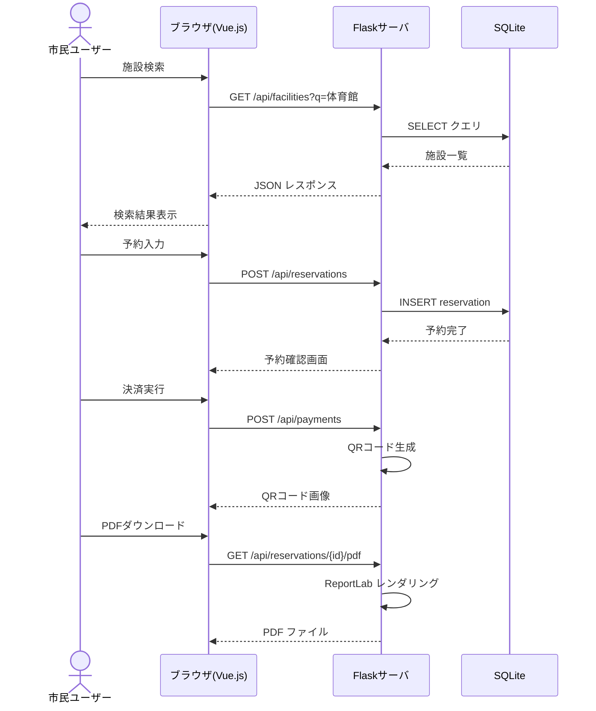

# システムアーキテクチャ概要

## 1. システム構成

```
┌──────────────────────────────────────────────────────────────┐
│                      Flask サーバ (Python)                    │
│                                                              │
│  ┌─────────────────────────────────┐  ┌───────────────────┐  │
│  │     静的ファイル配信             │  │   REST API (Blueprint) │
│  │  - index.html (Vue.js SPA)     │  │  - /api/users/*    │  │
│  │  - 静的アセット                 │  │  - /api/facilities/*│  │
│  │                                 │  │  - /api/reservations│  │
│  │                                 │  │  - /api/payments/* │  │
│  └─────────────────────────────────┘  └────────┬──────────┘  │
│                                                 │             │
│  ┌──────────────────────────────────────────────┘             │
│  │                                                              │
│  │  ┌──────────────────────────────────────────────────┐       │
│  │  │          SQLite データベース                       │       │
│  │  │  - users, facilities, reservations, payments      │       │
│  │  └──────────────────────────────────────────────────┘       │
└──────────────────────────────────────────────────────────────┘
```

## 2. 技術スタック

| 層 | 技術 | 備考 |
|---|---|---|
| フロントエンド | Vue.js 3 (CDN: unpkg) | ビルド不要、SPA構成 |
| CSS | Bootstrap 5 (CDN) | レスポンシブデザイン |
| 多言語対応 | Vue I18n (CDN) | ja / en / zh 対応 |
| バックエンド | Python 3.11+ / Flask | 単一プロセスで動作 |
| ORM | Flask-SQLAlchemy | SQLite バインディング |
| DB | SQLite | ファイルベース、軽量 |
| PDF生成 | ReportLab | 予約票PDF出力 |
| 認証 | Flask-Login | セッションベース認証 |
| QRコード | qrcode (Python) | ダミー決済QR表示 |

## 3. ディレクトリ構造

```
/
├── app.py                  # Flask エントリポイント
├── config.py               # 設定ファイル
├── requirements.txt        # Python 依存パッケージ
├── models/                 # SQLAlchemy モデル
│   ├── __init__.py
│   ├── user.py
│   ├── facility.py
│   ├── reservation.py
│   └── payment.py
├── routes/                 # API Blueprint ルート
│   ├── __init__.py
│   ├── auth.py
│   ├── facilities.py
│   ├── reservations.py
│   └── payments.py
├── services/               # ビジネスロジック
│   ├── __init__.py
│   ├── pdf_service.py
│   └── i18n_service.py
├── static/                 # 静的ファイル
│   ├── index.html          # Vue.js SPA エントリ
│   ├── css/
│   │   └── style.css
│   └── js/
│       ├── app.js          # Vue アプリケーション
│       ├── i18n.js         # 多言語設定
│       └── components/     # Vue コンポーネント
├── docs/                   # 設計ドキュメント
│   └── architecture/
├── dist/                   # 成果物出力先
└── exam.db                 # SQLite データベースファイル
```

## 4. データフロー (シーケンス)



## 5. 非機能要件

- **パフォーマンス**: 軽量SQLiteのため同時接続は想定10以下
- **セキュリティ**: パスワード bcrypt ハッシュ化、セッション管理
- **アクセシビリティ**: WAI-ARIA 対応、キーボードナビゲーション
- **多言語**: 日本語(デフォルト)、英語、中国語対応
