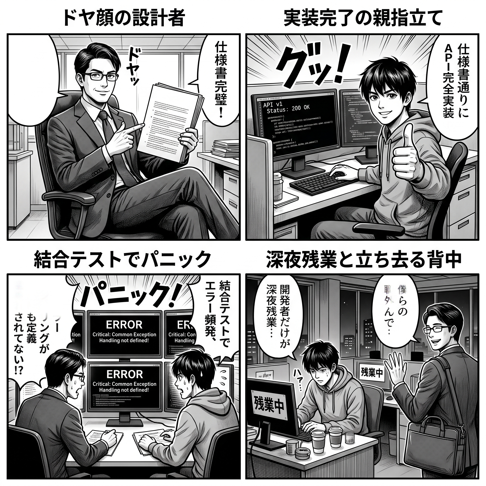
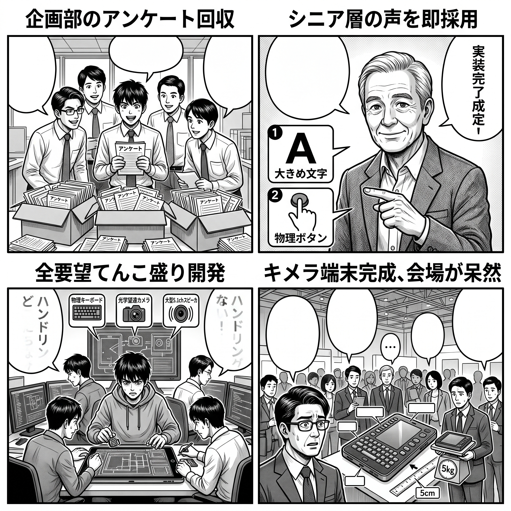
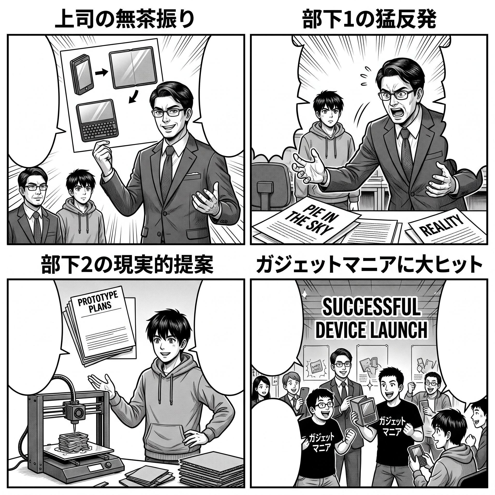

<!-- _class: title-bg -->
<!-- _paginate: false -->
<!-- _header: "" -->
<!-- _footer: "若手スキルアップ研修会 ｜ 40分セッション" -->

# その仕事、 下から見るか、上から見るか

### ― 具体化と抽象化に見る観点の転換 ｜ 「Whyで考える」 ―

  40分講演
  対象：若手社員・システム開発に携わるすべての方

<!--
【スピーカーノート（想定時間：1分）】
皆さんこんにちは！若手スキルアップ研修会へようこそ。
本日のテーマは『その仕事、下から見るか、上から見るか 〜具体化と抽象化に見る観点の転換〜』です。
本日の最重要キーワードはズバリ【Whyで考える】です。
仕事をしていると、「言われた通りに真面目にやったのに怒られた」「良かれと思って要望を聞いたら製品がぐちゃぐちゃになった」という理不尽な悲劇によく遭遇します。
なぜそんなことが起きるのか？ 答えは「How（やり方）」ばかり見て、「Why（なぜやるのか）」を見失っているからです。
大講堂の後ろの席の皆さんも、ぜひリラックスして思考実験を楽しんでください！
-->

---

# 😫 真面目にやっているのに、なぜか悲劇が起きる…

  

    <h3 style="color: #b91c1c;">🌀 現場の「3大あるある悲劇」</h3>
    <ul>
      <li><strong>「仕様書通りに作ったのに動かない」</strong> 誰も悪くないはずなのに、テストで大炎上</li>
      <li><strong>「お客様の要望を全部入れたのに不評」</strong> 親切に機能を追加したのに「使いにくい」と酷評</li>
      <li><strong>「絵に描いた餅だと笑っていたら…」</strong> 誰も完成形が分からずプロジェクトが漂流</li>
    </ul>
  

  

    <h3 style="color: #b45309;">💡 原因：手元の「How」に囚われている</h3>
    

      私たちは普段、手元の<strong>「具体・How（どう作るか）」</strong>に目を奪われがちです。
    

    

      👉 <strong>本日の鍵：</strong>一歩引いて「Why（そもそも何のため？）」から問い直す力を手に入れよう！
    

  

<!--
【スピーカーノート（想定時間：1.5分）】
一生懸命頑張っているのに、なぜか結果が裏目に出てしまう。
自分の担当範囲を完璧にこなしたのにシステムが動かない。ユーザーの要望を聞いてボタンを追加したのに怒られる。
これらはすべて、皆さんのスキル不足ではなく、「手元のHow（やり方）」に視野が固定されてしまっていることが原因です。
川下に立ちながら、同時に川上の「Why（そもそも何のために？）」を見晴らす。この視座の転換を学んでいきます。
-->

---

# 🎯 本日のアジェンダ：3つの現場ストーリー

  ゴール：手元の「How（作業）」から「Why（本質）」へ視点を引き上げ、観点を反転させる！

  

    第1章
    <h3 style="color: var(--accent-ch1);">職域の線引き</h3>
    
【組織と境界】 すき間に落ちたタスクと 見捨てられる川下 <strong>＋ 4コマ ＆ 思考実験①</strong>

  

  

    第2章
    <h3 style="color: var(--accent-ch2);">ユーザー意見の改善</h3>
    
【製品とビジョン】 声を聞きすぎて迷走する Whyなきキメラ端末 <strong>＋ 4コマ ＆ 思考実験②</strong>

  

  

    第3章
    <h3 style="color: var(--accent-ch3);">絵に描いた餅</h3>
    
【未来とイメージ】 誰も正解を知らない時 餅を描く本当の価値 <strong>＋ 4コマ ＆ 思考実験③</strong>

  

<!--
【スピーカーノート（想定時間：1.5分）】
本日のアジェンダです。今回はシステム開発のリアルな3つのテーマを深掘りします。
第1章は「職域の線引き」。きっちり分担したはずの組織で、なぜ狭間にボールが落ちて川下が炎上するのか。
第2章は「ユーザー意見の改善」。お客様ファーストで要望を足し算した結果、なぜWhyを見失ったキメラ端末が生まれるのか。
第3章は「絵に描いた餅」。机上の空論とバカにされがちな餅が、実は未知のプロジェクトを救う羅針盤になる理由。
各章に4コマ漫画と思考実験を用意しています。
-->

---

# 🙋‍♂️ Speaker & 本日のスタンス

  

    <h3>👨‍💼 スピーカー紹介</h3>
    

      

        💻
      

      

        
システム開発部 メンター担当

        
開発・要件定義・アーキテクチャ設計

      

    

    <ul style="font-size: 19px; margin-top: 10px;">
      <li>仕様書の行間を巡って数々の炎上を経験してきた元・若手SE</li>
      <li>「HowではなくWhyを問う」ことで仕事が激変した体験を共有！</li>
    </ul>
  

  

    <h3>🤝 本日のグラウンドルール</h3>
    <ol style="font-size: 19px; margin-top: 6px; line-height: 1.6;">
      <li><strong>「正解当てテスト」ではない！</strong> 現場のモヤモヤを言語化して楽しむ場です。</li>
      <li><strong>「あるある！」と笑い飛ばす</strong> 4コマを見ながら「うちの現場だ…」と共感してください。</li>
      <li><strong>自分の普段の仕事に引き寄せる</strong> 「自分ならどう動くか」を直感で考えましょう。</li>
    </ol>
  

<!--
【スピーカーノート（想定時間：1.5分）】
私自身、若い頃は「仕様書に書いてないから私の仕事じゃありません！」と主張して先輩と衝突したり、言われた要望を全部実装して画面をボタンだらけにして怒られたり、痛い失敗を山ほどしてきました。
今日の研修は、皆さんに説教をする場ではありません。「わかる、そういうことあるよね」と笑い合いながら、明日からの現場をちょっと楽にする知恵を持ち帰る場にしてください。
-->

---

# 🌊 「川上（抽象・Why）」と「川下（具体・How）」

  

    川下 ＝ 具体（Concrete）
    <h3 style="color: #0284c7; margin-top: 4px;">下から見る ｜ 虫の目（How）</h3>
    <ul>
      <li><strong>問い：</strong>「How（どう作るか？ 手順は？）」</li>
      <li><strong>対象：</strong>ソースコード、目前のタスク、画面設計</li>
      <li><strong>価値：</strong>実際に動かす力、緻密さ、実装スピード</li>
      <li>⚠️ 罠：部分最適。森の崩壊に気づかない</li>
    </ul>
  

  

    川上 ＝ 抽象（Abstract）
    <h3 style="color: #7c3aed; margin-top: 4px;">上から見る ｜ 鳥の目（Why）</h3>
    <ul>
      <li><strong>問い：</strong>「Why（そもそも何のため？ 誰のため？）」</li>
      <li><strong>対象：</strong>全体目的、ビジネス価値、製品ビジョン</li>
      <li><strong>価値：</strong>本質を見抜く力、方向性の決定、軌道修正</li>
      <li>⚠️ 罠：実装を知らないと机上の空論になる</li>
    </ul>
  

  🔑 重要なのは、<strong>川下（How）で手を動かしながら、川上（Why）を見晴らす「往復運動」</strong>！

<!--
【スピーカーノート（想定時間：2分）】
川下（具体）は「How（どう作るか）」の世界です。これがないとモノは動きません。
しかし川下だけに閉じこもると、「自分の担当モジュールは動いたから、システム全体が止まっても関係ない」という部分最適に陥ります。
一方の川上（抽象）は、「Why（そもそも何のために？）」という全体目的の世界です。
この2つの視点を自由に行き来できるようになることが、プロフェッショナルの条件です。
-->

---

<!-- _class: chapter-bg-1 chapter-slide -->
<!-- _paginate: false -->
<!-- _header: "" -->
<!-- _footer: "若手スキルアップ研修会 ｜ 第1章" -->

  第 1 章
  <h1 style="font-size: 46px; margin-top: 20px; color: #ffffff; font-weight: 900;">
    きっちり線引きされた職域
  </h1>
  

    〜 中間に落ちたタスクと、見捨てられる川下の負担 〜
  

<!--
【スピーカーノート（想定時間：0.5分）】
それでは第1章に入ります。
『きっちり線引きされた職域 〜中間に落ちたタスクと、見捨てられる川下の負担〜』。
まずは現場で本当によくある光景を4コマ漫画で見てみましょう。
-->

---

# 🎭 【4コマ】きっちり線引きされた職域の悲劇

  
  <!-- コマ1 左上吹き出し -->
  

    私の職域は ここまでです！
  

  <!-- コマ3 左吹き出し上書き補正 -->
  

    エラーハンドリングが 定義されてない!?
  

<!--
【スピーカーノート（想定時間：2分）】
この4コマ、身に覚えがありませんか？
設計者は「仕様書通りに書いた」、プログラマーは「仕様書通りにコードを書いた」。誰もサボっていません。全員が自分の「線引きされた職域」の中では100点満点です。
しかし結合テストになるとエラーで動かない。なぜなら「システム同士の狭間にある共通仕様」がどちらの担当範囲にも定義されていなかったからです。
そして最悪なのは4コマ目。「私の担当範囲外ですから」と川上が去り、川下のテスターや運用チームだけが深夜残業で火消しをさせられる。
これが「きっちり線引きされた職域」が引き起こす組織の機能不全です。
-->

---

# 🧱 組織の枠組み全体から見る：境界線の「すき間」

  

    <h3 style="color: #b91c1c;">⬇️ 下から見る視点（部分最適）</h3>
    <ul>
      <li>「自分の職域を守ることが誠実さ」</li>
      <li>「仕様書に書いていないことはやらない」</li>
      <li><strong>結果：境界線上に落ちたボールを誰も拾わない</strong></li>
      <li>川上は手離れの良さだけを求め、川下の苦労を想像しない</li>
    </ul>
  

  

    <h3 style="color: var(--accent-ch1);">⬆️ 上から見る視点（全体最適）</h3>
    <ul>
      <li>「システム全体が無事動いて初めて全員の勝利」</li>
      <li><strong>現実の仕事は、きれいな線引きの『すき間』にこそ本質がある</strong></li>
      <li>川上は「川下がどう受け取るか？」まで考えてパスを出す</li>
      <li>「Why（全体の目的）」のために境界を越える人が組織を救う</li>
    </ul>
  

  💡 <strong>観点の転換：</strong>「自分の持ち場を守る（How）」から、「システム全体の成功（Why）」へ視座を引き上げよう！

<!--
【スピーカーノート（想定時間：2分）】
下から見ると、「自分の職域を守る」のは真面目で正しい行動に見えます。
しかし、上から組織全体を見渡すとどうでしょうか。どんなに綺麗に職域を線引きしても、現実の開発には必ず「境界線のすき間」が発生します。
サッカーで言えば、ディフェンスとミッドフィルダーの間に転がったボールを「あそこは私のエリアじゃないから」とお互いに見送って失点しているようなものです。
一流のビジネスパーソンは、川上に立ちながら「この仕様の書き方だと後工程が困るな」と川下の負担を想像し、境界を少し踏み出してパスを出します。
-->

---

# 🧠 【Work 1】思考実験：仕様書の考慮漏れを発見！

  

    THINKING WORK 01
    ⏱ 目安時間：3分（個人思考 1分 ＋ 周囲とシェア 2分）
  

  

    📌 状況：前工程の仕様書に「アクセス集中時のタイムアウト処理」が全く考慮されていないことに気づいた！
  

  

    
パターン A ｜ 職域厳守型（Howの論理）

    

      「仕様書に書いてないし、余計なことをして怒られたくない。指示通り作って、テストでエラーが出たら指摘しよう」
    

  

  

    
パターン B ｜ 全体視野型（Whyの論理）

    

      「本番で落ちたら大惨事になるな。今のうちに『タイムアウト時の挙動はどうしますか？』と設計担当にチャットで1本声をかけよう」
    

  

  💬 <strong>問いかけ：</strong>あなたの現場はどちらの空気が強いですか？ あなた自身はどちらになりがちですか？

<!--
【スピーカーノート（想定時間：3分）】
最初の思考実験です。
仕様書の抜け漏れに気づいたとき、あなたならどうしますか？
パターンAは職域を守る人です。「言われてないからやらない」。でも後で手戻りになって結局自分が深夜まで直す羽目になります。
パターンBは川上と川下の繋がりが見えている人です。いま声をつなぐだけで、未来の巨大な炎上を未然に防ぐことができます。
周囲の方と1〜2分、職場のリアルな空気感を話し合ってみてください。
-->

---

<!-- _class: chapter-bg-2 chapter-slide -->
<!-- _paginate: false -->
<!-- _header: "" -->
<!-- _footer: "若手スキルアップ研修会 ｜ 第2章" -->

  第 2 章
  <h1 style="font-size: 46px; margin-top: 20px; color: #ffffff; font-weight: 900;">
    ユーザー意見を取り入れた製品改善
  </h1>
  

    〜 「How（要望）」を鵜呑みにせず、「Why」で考える 〜
  

<!--
【スピーカーノート（想定時間：0.5分）】
続いて第2章です。
『ユーザー意見を取り入れた製品改善 〜「How（要望）」を鵜呑みにせず、「Why」で考える〜』。
ユーザーの声を聴くのは絶対に正しいはずです。
しかし、なぜそれが「キメラ端末」という悲劇を招くのでしょうか？ 4コマで見てみましょう。
-->

---

# 🎭 【4コマ】全部入りキメラ端末の誕生

  
  <!-- コマ1 吹き出し中 -->
  

    お客様アンケート 回収したよ！
  

  <!-- コマ1 吹き出し右 -->
  

    製品改善の ために！
  

  <!-- コマ1 吹き出し左 -->
  

    ご意見を 徹底収集！
  

  <!-- コマ2 吹き出し -->
  

    「文字大きめ」 「物理ボタン」 ふむ、採用だな！
  

  <!-- コマ3 左吹き出し -->
  

    物理キーと 光学ズームも！
  

  <!-- コマ3 右吹き出し -->
  

    Hi-Fiスピーカ 全部乗せだ！
  

  <!-- コマ4 吹き出し1 (左) -->
  

    できま した！
  

  <!-- コマ4 吹き出し2 (中左) -->
  

    なんだこの キメラ…
  

  <!-- コマ4 吹き出し3 (中・小) -->
  

    …
  

  <!-- コマ4 吹き出し4 (中右) -->
  

    重さ 5kg!?
  

  <!-- コマ4 吹き出し5 (右) -->
  

    誰が使うの これ…
  

<!--
【スピーカーノート（想定時間：2分）】
新型タブレットを改善しようとアンケートをとりました。
「画面の文字を大きくして」「押しやすい物理ボタンをつけて」「キーボードもほしい」「カメラも一眼レフ並みに」「いいスピーカーも」。
若手企画者は要望をすべて仕様書に盛り込みました。
そして出来上がったのは、重さ5kg、厚さ5cm、ボタンが何十個もついた「キメラ端末」です。
シニアは重くて持てず、ビジネスマンは持ち歩けず、誰も買わない最悪の製品になりました。
なぜこうなったのか？ 顧客が言った「How（手段）」をそのまま足し算し、「Why（なぜそれを求めているのか）」を考えなかったからです。
-->

---

# 🔎 具体（How）の足し算をやめ、「Why」で考える

  

    <h3 style="color: #b91c1c;">❌ 失敗：顧客の「How」を鵜呑みにする</h3>
    <ul>
      <li>「このボタンをつけて」「この機能が欲しい」</li>
      <li>要望をパッチワークのように全部足し算する</li>
      <li><strong>結果：誰のためか分からない総花的なゴミになる</strong></li>
      <li>リモコンのボタンが100個あって誰も使えない状態</li>
    </ul>
  

  

    <h3 style="color: var(--accent-ch2);">⭕ 成功：1段抽象化して「Why」を問う</h3>
    <ul>
      <li>「そもそも、なぜその機能が欲しいのか？」</li>
      <li>ヘンリー・フォードの名言： 
        「もし顧客に何が欲しいか聞いていたら、『もっと速い馬』と答えただろう」</li>
      <li>顧客が語るのは「手段（How）」。開発者が考えるべきは「真の目的（Why）」！</li>
    </ul>
  

  💡 <strong>第2章の鍵：</strong>言われた通りのボタンを付けるな。「Whyで考える」ことで、本質的な価値を引き算で作ろう！

<!--
【スピーカーノート（想定時間：2分）】
自動車を発明したヘンリー・フォードはこう言いました。「顧客に何が欲しいか聞いたら、『もっと速い馬が欲しい』と答えただろう」。
顧客は「How（目の前の手段）」しか語れません。しかしフォードは「Why（なぜ？）」を考えました。「顧客が本当に求めているのは馬ではない。『もっと速く移動すること』だ」。だから自動車を作ったのです。
顧客の言う「このボタンを増やして」をそのまま鵜呑みにするのはプロの仕事ではありません。
「なぜそのボタンが必要なのか？」とWhyを自問し、真の課題を見抜いて引き算をするのが製品企画・開発の真髄です。
-->

---

# 🧠 【Work 2】思考実験：「検索条件をあと15個増やして！」

  

    THINKING WORK 02
    ⏱ 目安時間：3分（個人思考 1分 ＋ 周囲とシェア 2分）
  

  

    📌 状況：ユーザー部門から「検索画面に、あと15個の絞り込み条件ドロップダウンを追加してほしい！」と強い要望が届いた。
  

  

    
パターン A ｜ Howを鵜呑み（キメラ化）

    

      「顧客要望だから断れない！」と15個の入力欄をズラリ追加。画面が真っ青になり、一般ユーザーは使い方が分からなくなる。
    

  

  

    
パターン B ｜ Whyで考える（本質解決）

    

      「なぜ15個も？」と目的を聞く。「月末の未承認伝票を探したいだけ」と判明し、『ワンクリック未承認ボタン』を1つ提案！
    

  

  💬 <strong>問いかけ：</strong>あなたが最近関わった機能で、「言われるがまま作ってキメラ化した機能」はありませんか？

<!--
【スピーカーノート（想定時間：3分）】
第2の思考実験です。
現場から「絞り込み条件を15個増やしてくれ」と言われました。
パターンAはそのまま追加。画面はごちゃごちゃになり、サーバーの検索負荷も激増します。
パターンBは「Why（なぜそれをしたいのか？）」を聞きに行きます。すると、「実は月末に未承認の伝票を一発で見つけたいだけだった」と分かります。
であれば、15個の入力欄を作る必要なんて全くないですよね。「ワンクリック未承認ボタン」を1個置けば、ユーザーも大喜び、開発工数も10分の1です。
これが「Whyで考える」威力です。
-->

---

<!-- _class: chapter-bg-3 chapter-slide -->
<!-- _paginate: false -->
<!-- _header: "" -->
<!-- _footer: "若手スキルアップ研修会 ｜ 第3章" -->

  第 3 章
  <h1 style="font-size: 46px; margin-top: 20px; color: #ffffff; font-weight: 900;">
    絵に描いた餅
  </h1>
  

    〜 誰も完成形をイメージできていないプロジェクトの悲劇 〜
  

<!--
【スピーカーノート（想定時間：0.5分）】
最後の第3章です。
『絵に描いた餅 〜誰も完成形をイメージできていないプロジェクトの悲劇〜』。
「そんなの絵に描いた餅だ、もっと現実を見ろ！」……よく聞く言葉ですよね。
しかし、本当に絵に描いた餅は役に立たないのでしょうか？
-->

---

# 🎭 【4コマ】折り畳みタブレットの奇跡

  
  <!-- コマ1 左吹き出し -->
  

    折り畳みで スマホ兼用端末 作って！
  

  <!-- コマ1 右吹き出し -->
  

    もちろん 物理キーも 付けてね！
  

  <!-- コマ2 トゲトゲ吹き出し -->
  

    そんな絵に描いた餅、売れるわけない！ 現実見て！
  

  <!-- コマ3 左吹き出し -->
  

    まぁまぁ、 とりあえず 作ってみようよ
  

  <!-- コマ3 右吹き出し -->
  

    3Dプリンタで モック完成！
  

  <!-- コマ4 吹き出し上 -->
  

    できま した！
  

  <!-- コマ4 吹き出し下 -->
  

    なんか よく分から んけど…
  

  <!-- コマ4 吹き出し右 -->
  

    ガジェットマニアに 大ヒットだー！！
  

<!--
【スピーカーノート（想定時間：2分）】
上司が無茶振りをしました。「折り畳めてスマホにもなってキーボードもつく端末を作ろう！」。
部下1は「そんな絵に描いた餅、技術的に無理だし売れない。現実を見ろ」と切り捨てました。
しかし部下2は、「まあまあ、粗くてもいいからまずダンボールと3Dプリンタで形にしてみようよ」と作ってみた。
すると実物を見て「あ、ここをこうすれば使えるかも！」とアイデアが連鎖し、結果的にガジェットマニアに大ヒットして新しい市場を切り拓きました。
-->

---

# 🎨 未知の領域でこそ「絵に描いた餅」が命綱になる

  

    <h3 style="color: #b91c1c;">❌ 「現実ばかり見る」現場の罠</h3>
    <ul>
      <li>「実現可能性（フィージビリティ）が出るまで動かない」</li>
      <li>「前例がないから作れない」「失敗の責任は誰が？」</li>
      <li><strong>結果：誰も完成形をイメージできず、座礁する</strong></li>
      <li>足元（How）だけ見て歩くと、暗闇で迷子になる</li>
    </ul>
  

  

    <h3 style="color: var(--accent-ch3);">⭕ 「絵に描いた餅」の3大パワー</h3>
    <ul>
      <li><strong>① ベクトルの一致：</strong>「あそこを目指すぞ」と視線が揃う</li>
      <li><strong>② 議論の触媒：</strong>絵があるから「ここを直そう」と始まる</li>
      <li><strong>③ 未知の突破口：</strong>知らない未来を描く勇気が人を動かす</li>
    </ul>
  

  💡 <strong>観点の転換：</strong>「食べられない餅」と捨てるな。「未来を手繰り寄せる北極星（ビジョン）」として餅を描こう！

<!--
【スピーカーノート（想定時間：2分）】
「絵に描いた餅」はネガティブに使われがちです。
しかし、DXや新規AI開発など「誰も正解を知らない未知のプロジェクト」において、最初から食べられる本物の餅なんてどこにもありません。
粗削りでもいい。「私たちはこの世界を作りたいんだ！」という絵に描いた餅（抽象的なビジョンやプロトタイプ）を描くからこそ、チーム全員の視線が揃い、議論が動き出します。
知らないことを恐れずに、まず絵を描いてみる。これが若手にとって最強の武器になります。
-->

---

# 🧠 【Work 3】思考実験：正解のない新規AI案件！

  

    THINKING WORK 03
    ⏱ 目安時間：3分（個人思考 1分 ＋ 周囲とシェア 2分）
  

  

    📌 状況：社内で「生成AIを使った新サービスを作れ」と特命チームに配属されたが、誰も具体的に何をすればいいか分からず沈黙している。
  

  

    
パターン A ｜ 確実性重視（現実主義）

    

      「成功事例やガイドラインが完璧に固まるまで、下手な提案はせず様子を見よう。絵に描いた餅を言って恥をかきたくない」
    

  

  

    
パターン B ｜ 餅先行型（ビジョン提示）

    

      「技術的に可能か不明ですが、こんなAI画面があったら最高じゃないですか？」と手書きスケッチを投げて議論を起こす！
    

  

  💬 <strong>問いかけ：</strong>プロジェクトを本当に前進させるのは、どちらのスタンスだと思いますか？

<!--
【スピーカーノート（想定時間：3分）】
最後の思考実験です。
誰も正解がわからない新規AI案件にアサインされました。
パターンAは賢い現実主義者です。でも全員がAをやったら、会議は永遠に沈黙し、プロジェクトは1ミリも進みません。
パターンBは「絵に描いた餅を描く人」です。「技術的にできるか分からないけど、こんな画面で動いたらワクワクしません？」と叩き台を出す。
すると周りのベテランが「いやそのAPIは無理だけど、こっちのモデルならできるぞ！」と動き出すのです。
未知のプロジェクトを動かすのは、いつだって「最初に粗い絵を描いた人」です。
-->

---

# 🔄 まとめ：観点が変われば「正義」は反転する

<table style="width: 100%; border-collapse: collapse; margin-top: 8px; font-size: 18px;">
  <thead>
    <tr style="background-color: #f1f5f9; border-bottom: 2px solid #cbd5e1;">
      <th style="padding: 10px; text-align: left; width: 22%;">テーマ</th>
      <th style="padding: 10px; text-align: left; width: 39%;">⬇️ 下から見る視点（How・具体）</th>
      <th style="padding: 10px; text-align: left; width: 39%;">⬆️ 上から見る視点（Why・抽象）</th>
    </tr>
  </thead>
  <tbody>
    <tr style="border-bottom: 1px solid #e2e8f0;">
      <td style="padding: 10px; font-weight: 800;">第1章：職域の線引き</td>
      <td style="padding: 10px;">「担当範囲をきっちりやり切る （責任の明確化）」</td>
      <td style="padding: 10px; color: #0284c7; font-weight: 800;">反転 ➔ 「すき間のボールを誰も拾わず、川下が炎上する無責任」</td>
    </tr>
    <tr style="border-bottom: 1px solid #e2e8f0;">
      <td style="padding: 10px; font-weight: 800;">第2章：顧客の意見</td>
      <td style="padding: 10px;">「顧客の要望を全部真面目に入れる （顧客第一主義）」</td>
      <td style="padding: 10px; color: #ea580c; font-weight: 800;">反転 ➔ 「Whyを見失い、誰も使えないキメラ端末を生む怠慢」</td>
    </tr>
    <tr style="border-bottom: 1px solid #e2e8f0;">
      <td style="padding: 10px; font-weight: 800;">第3章：絵に描いた餅</td>
      <td style="padding: 10px;">「実現不可能な机上の空論 （役に立たない無駄）」</td>
      <td style="padding: 10px; color: #16a34a; font-weight: 800;">反転 ➔ 「未知の暗闇で全員のベクトルを揃える唯一の羅針盤」</td>
    </tr>
  </tbody>
</table>

  🎭 下から見れば「100点満点の正義」が、上から見ると「大失敗の元凶」に反転する！

<!--
【スピーカーノート（想定時間：2分）】
研修のまとめです。3つの章で見てきた景色を振り返ってみましょう。
下から見ると「職域を守る」「顧客の要望を聞く」「現実的なものだけ作る」というのは、どれも真面目で正しい行動に見えます。
しかし、上から見ると全てが真逆に反転します。
職域遵守は「無責任な分断」になり、要望の全採用は「キメラ端末」を生み、絵に描いた餅の否定は「プロジェクトの漂流」を招く。
逆に、下から見れば「役立たず」と叩かれがちな絵に描いた餅が、上から見れば「未来を照らす唯一の北極星」になる。
この反転に気づく鍵こそが、「Whyで考える」ことなのです。
-->

---

# 🎁 本日持ち帰ってほしい、たった1つのこと

  
今日、これだけは絶対に持ち帰ってください！

  

    「How（やり方）」の前に、 まず「Why（なぜ？）」で考える！
  

  

    作業に追われた時こそ、1回立ち止まって「そもそも何のためだっけ？」と自問する。
  

  

    <strong>🧱 職域のすき間で</strong> 「Why：システム全体を成功させるために」境界を一歩越える
  

  

    <strong>🧩 要望を聞いた時</strong> 「Why：顧客が本当に叶えたい課題は何？」と目的を深掘りする
  

  

    <strong>🎨 先が見えない時</strong> 「Why：目指す理想の未来は何か？」とまず粗い餅を描く
  

<!--
【スピーカーノート（想定時間：2分）】
今日、たくさんの話をしましたが、たった1つだけ持ち帰るならこれです。
「How（どうやるか）」の前に、まず「Why（なぜやるのか）」で考える！
明日会社に行って、タスクに追われてキーボードを叩きまくっている自分に気づいたら、ふと1回手を止めてください。
「そもそも、なぜこの仕事をやっているんだっけ？」
この1秒の自問が、あなたを単なる「作業者」から「自律的なプロフェッショナル」へと変貌させます。
-->

---

<!-- _class: title-bg -->
<!-- _paginate: false -->
<!-- _header: "" -->
<!-- _footer: "若手スキルアップ研修会 ｜ おわりに" -->

# その仕事、下から見るか、上から見るか

  川下で<strong>泥臭く手を動かし、やりきる力（How）</strong>。 
  川上から<strong>本質を見晴らし、未来を描く力（Why）</strong>。 
  どちらか一方ではなく、 
  「どちらからも見られる自由」を手に入れたとき、仕事は劇的に面白くなります。

  
💬 質疑応答 ＆ 感想共有タイム

  

    本日の感想、現場でのモヤモヤ、「明日からWhyで考えます！」の宣言など、何でも大歓迎です！
  

<!--
【スピーカーノート（想定時間：6分（まとめ1分 ＋ 質疑応答5分））】
最後に、タイトルの問いにお答えして締めくくりたいと思います。
「その仕事、下から見るか、上から見るか」。
答えは、「両方から見る」です。
川下を知っているからこそ、地に足のついた設計ができます。
川上を知っているからこそ、手元のコードに魂が宿ります。
下からも上からも見られる自由を、ぜひ今日から手に入れてください。
ご清聴ありがとうございました！ これより質疑応答に入ります。
-->
